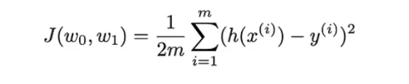
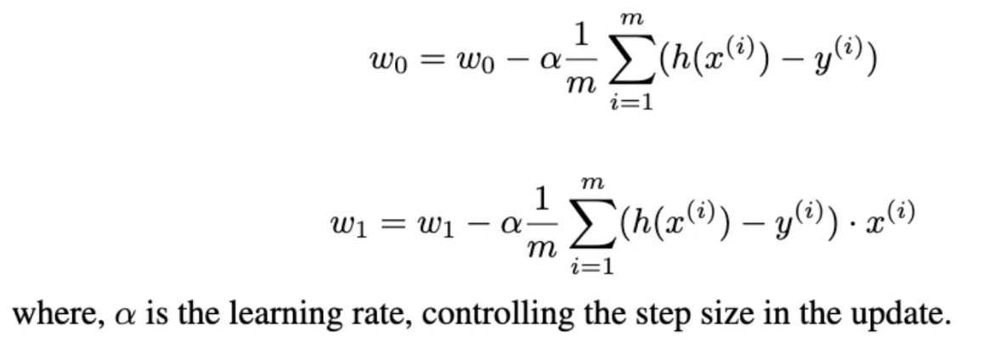

# Implementing ML algorithms from scratch
- in pursuit of gaining a fundamental understanding.

## 1. Linear Regression:
- find the best fit for y = wx + b; w = weight, b = bias
- assuming that there is only one input variable i.e. x
- once implemented, can be extended to multiple dimensions i.e. y = w1x1 + w2x2 + ... + wnxn + b
### Gradient Descent:
- this is the cost function we're optimizing for

- this is the gradient descent update rule we're using:

